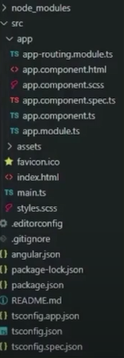

# Proje Yapılanması

---

Bir Angular projesi oluşturduğumuzda, aşağıdaki görselde görüldüğü gibi dosyalar gelir:

---
## 📂 **Proje Klasör Yapısı**

---

- **`node_modules`**:  
  Uygulamada kullanılan paketler bu dizinde bulunur. (Dışarıdan yüklediğiniz üçüncü parti eklentiler de burada yer alır.)

- **`src`**:  
  Uygulamanın en önemli klasörüdür. Proje geliştirirken çalışmalarınızın büyük bir kısmı burada geçer, çünkü uygulamanın hayati dosyalarını içerir.

- **`assets`**:  
  Uygulamayla ilgili resim, ikon, video gibi medya dosyalarını içerir.

- **`index.html`**:  
  Uygulamanın temel HTML sayfasıdır. Angular’ın ana bileşenini içine yerleştirdiği temel yapı buradadır.

- **`main.ts`**:  
  Uygulamanın başlangıç dosyasıdır. C#’daki **`Program.cs`** dosyasına benzetilebilir. Burada, hangi modülün ana modül olarak yükleneceği belirlenir.

- **`.editorconfig`**:  
  Editörle ilgili temel konfigürasyon ayarlarını içerir.

- **`angular.json`**:  
  Uygulamayla ilgili script, stil, bütçe ayarları gibi temel konfigürasyonları barındırır.

- **`package-lock.json`**:  
  Uygulamada kullanılan paketlerin sürüm bilgilerini içerir. Böylece bağımlılıkları doğru şekilde yönetmek için kullanılır.

- **`package.json`**:  
  Uygulamada kullanılan paketlerin listesini içerir. **`node_modules`** klasörünü projeye dahil etmeden, sadece **`package.json`** dosyasını kullanarak gerekli bağımlılıkların yüklenmesi sağlanır. Çünkü karşı tarafa **`node_modules`** klasörünü gönderirsek bu gb'larca yer kaplar ve bunu istemeyiz.

---

 ## 📂 **`src/app` Klasörü**

---
Bu klasör, Angular uygulamasının bileşenlerini (**components**) ve diğer temel yapı taşlarını içerir.

1. **`app-routing.module.ts`**
    - Uygulamada sayfalar arası yönlendirme (**routing**) ayarlarını içerir.

2. **`app.component.html`**
    - Ana bileşenin (**app.component.ts**) HTML şablonudur.

3. **`app.component.ts`**
    - Ana bileşenin TypeScript dosyasıdır.

4. **`app.component.scss`**
    - Ana bileşenin stil dosyasıdır.

5. **`app.component.spec.ts`**
    - Ana bileşenin test dosyasıdır.

6. **`app.module.ts`**
    - Uygulamanın ana (**root**) modülüdür.
